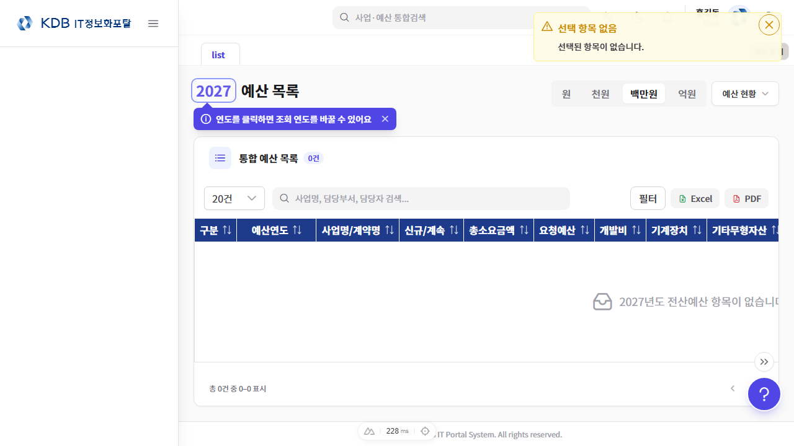
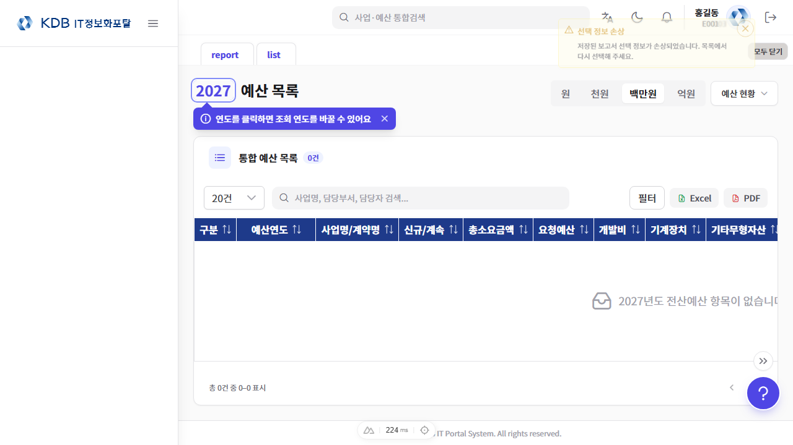
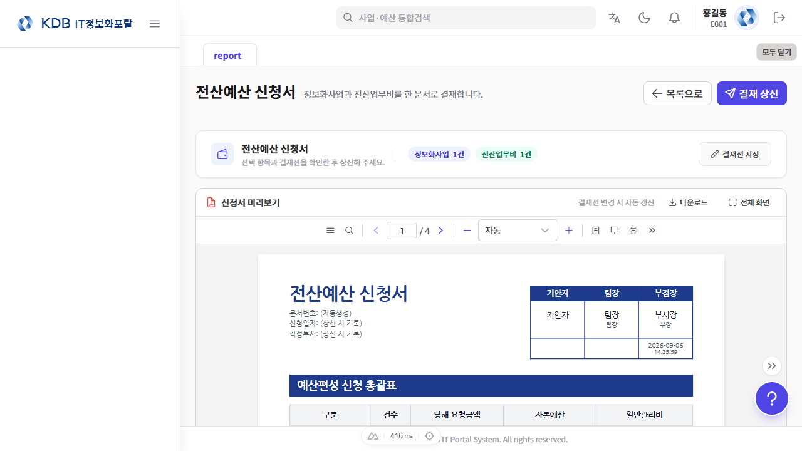
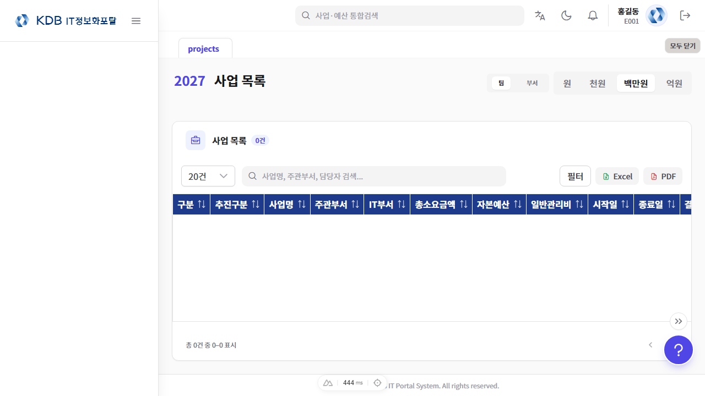

# 테스트 결과서

## 주요내용

### [요청자 정보]

| 항목 | 내용 |
| --- | --- |
| 요청일자 | 2026-09-14 |
| 요청부서 | IT기획부 |
| 요청문서번호 | 자체개선 |
| 요청자명 | 박종훈 차장 |

### [작성자 정보]

| 항목 | 내용 |
| --- | --- |
| 작성일자 | 2026-09-15 |
| 작성자명 | 박종훈 |

### [테스트 결과]

- **(대상 문서)** 분석/설계서 `docs/design-docs/2026-09-15-analysis-design-since-260914.md` · 요건 22건 · 시나리오 57건
- **(실행 일시)** 2026-09-15 19:13 ~ 19:24 · it_frontend `76d897e6` · it_backend `78c37a91`
- **(실행 명령)** `npx vitest run tests/unit/components/EmployeeSearchDialog.test.ts … 외 39개` · `./gradlew test --tests '*CostQueryAssemblerTest' … 외 6개` · `npx playwright test tests/e2e/budget-report-session.spec.ts tests/e2e/projects.spec.ts`(nuxt dev 3002 자동 기동, 스크린샷 상시)
- **(증적 위치)** `docs/test-docs/evidence/2026-09-15/` · 세부내용 표의 증적 경로는 이 디렉터리 기준
- **(결과 요약)** 총 57건 · PASS 33 · FAIL 2 · 미실시 22(사용자 22·E2E 0) · 미확인 0
- **(결과 도식)** 구분별 결과를 한눈에

```flow
[시나리오 57건]
      │
      ├─ Vitest   : 27건 → PASS 27 · FAIL 0
      ├─ Jacoco   : 6건 → PASS 6 · FAIL 0
      ├─ E2E      : 2건 → PASS 0 · FAIL 2
      └─ 사용자   : 22건 → 미실시 22(현업 확인 후 기입)
      │
[판정] 자동화 PASS 33/35 · FAIL 2(E2E 계약 불일치) · 사용자 확인 대기 22
```

#### 테스트 세부내용 (총 57건)

| TEST ID | 시나리오명 | 구분 | 점검 포인트 | 예상결과 | 실제결과 | 증적 |
| --- | --- | --- | --- | --- | --- | --- |
| **TC-01** | 요건 1 – 직원검색 기본 범위 | Vitest | `tests/unit/components/EmployeeSearchDialog.test.ts` · 기본 범위 prop 미지정 시 부서, 'all' 지정 시 전체 · prop에 따라 라디오 초기값 결정 · 전체 검색이 부서 밖 직원 반환 | PASS | PASS | tests/unit/components/EmployeeSearchDialog.test.ts → 20/20 passed · 로그 vitest.log |
| **TC-02** | 요건 1 – IT담당부서 검색 | 사용자 | 정보화사업 예산 작성 · IT담당부서 담당팀장·담당자 [직원검색] 클릭 · 검색범위 '전체'로 열림 · 다른 필드는 '부서' | PASS | 미실시 | 사용자 확인 필요 |
| **TC-03** | 요건 2 – 첫 방문 안내 상태 | Vitest | `tests/unit/composables/useFirstVisitHint.test.ts` · `tests/unit/components/YearPickerTitle.test.ts` · 표시·닫기 emit·저장소 실패 시 메모리 동작 · 닫기·연도 클릭 시 닫힘 emit · localStorage 기록 후 재표시 없음 | PASS | PASS | tests/unit/composables/useFirstVisitHint.test.ts → 5/5 passed · tests/unit/components/YearPickerTitle.test.ts → 10/10 passed · 로그 vitest.log |
| **TC-04** | 요건 2 – 예산 목록 첫 방문 | 사용자 | 새 브라우저 프로필로 통합 예산 목록 진입 → 안내 닫기 → 새로고침 · 연도 버튼 강조·말풍선 1회 표시 · 새로고침 후 미표시 | PASS | 미실시 | 사용자 확인 필요 |
| **TC-05** | 요건 3 – 전년도 예산 조립 | Jacoco | `src/test/java/.../cost/service/CostQueryAssemblerTest.java` · 배치 경계에서 이전 예산·편성 예산을 행 기준연도로 채움 · 전년도 금액·통화가`LST_YN='Y'` 원장에서 IN 배치 1회로 채워짐 | PASS | PASS | CostQueryAssemblerTest → 15/15 passed · `TEST-com.kdb.it.domain.budget.cost.service.CostQueryAssemblerTest.xml` · 로그 gradle-test.log |
| **TC-06** | 요건 3 – 전년도 예산 통화 표기 | Vitest | `tests/unit/composables/costList/useCostCurrencyDisplay.test.ts` · 전년도 예산은 행 통화, 통화 없으면 원화 · USD 행은`US$` · 통화 없음은 `₩` | PASS | PASS | tests/unit/composables/costList/useCostCurrencyDisplay.test.ts → 7/7 passed · 로그 vitest.log |
| **TC-07** | 요건 3 – 외화 행 대조 | 사용자 | 전산업무비 일괄 작성 · 전년도 USD 계약 불러온 행의 예산(YYYY-1/YYYY) 컬럼 · 전년도·당해 모두 외화 표시 · 툴팁에 환율·기준월 | PASS | 미실시 | 사용자 확인 필요 |
| **TC-08** | 요건 4 – 관리자 전체 부서 | Vitest | `tests/unit/composables/useBudgetApprovalPage.test.ts` · 관리자 전체 선택 시 모든 부서 표시 · 전체 부서 데이터 요청 · 관리자만 전체 요청 · 기본 소속부서 · 임시저장 판정은 표시 집합 기준 | PASS | PASS | tests/unit/composables/useBudgetApprovalPage.test.ts → 48/48 passed · 로그 vitest.log |
| **TC-09** | 요건 4 – 담당부서 필터 조작 | 사용자 | 시스템관리자로 결재 상신 진입 → 담당부서 '전체'·특정 부서 변경 · 기본 소속부서 → 선택에 따라 목록·건수 갱신 · 일반 사용자는 필터 미노출 | PASS | 미실시 | 사용자 확인 필요 |
| **TC-10** | 요건 5 – 범위 토글 옵션 | Vitest | `tests/unit/components/info/InfoDashboardScopeToggle.test.ts` · 팀 포함·전체 숨김·팀 비활성 조합 · [IT담당][팀][부서][전체] 순서 · 일반 사용자 [전체] 없음 · 팀코드 없으면 [팀] 비활성 | PASS | PASS | tests/unit/components/info/InfoDashboardScopeToggle.test.ts → 8/8 passed · 로그 vitest.log |
| **TC-11** | 요건 5 – 전산업무비 팀 쿼리 | Vitest | `tests/unit/composables/useCostListPage.test.ts` · 팀코드 있으면 기본 범위 팀, 부서 조건과 팀코드 함께 전송 · 팀 범위만 팀코드 포함 · 부서는 미포함 · 관리자 전체는 부서 강제 해제 | PASS | PASS | tests/unit/composables/useCostListPage.test.ts → 131/131 passed · 로그 vitest.log |
| **TC-12** | 요건 5 – 정보화사업 팀 필터 | Vitest | `tests/unit/composables/project/useProjectListFilters.test.ts` · 팀 제외·부서 포함·전체 동기화·주관부서 선택 복귀 · 같은 부서 다른 팀 사업이 [팀]에서 제외, [부서]에서 포함 | PASS | PASS | tests/unit/composables/project/useProjectListFilters.test.ts → 27/27 passed · 로그 vitest.log |
| **TC-13** | 요건 5 – 저장 후 팀 불일치 안내 | Vitest | `tests/unit/composables/cost/useCostFormSave.test.ts` · `tests/unit/features/project/useProjectFormSave.test.ts` · 불일치 토스트 1회·표시 시간 · 불일치 1건 이상이면 info 토스트 1회 · 전부 일치·팀코드 없음이면 없음 | PASS | PASS | tests/unit/composables/cost/useCostFormSave.test.ts → 55/55 passed · tests/unit/features/project/useProjectFormSave.test.ts → 21/21 passed · 로그 vitest.log |
| **TC-14** | 요건 5 – 팀 범위 조회 | 사용자 | 전산업무비 일괄 작성·사업 목록 진입 → [팀]→[부서] 전환 → 다른 팀 담당자로 저장 · 기본 [팀]에 내 팀 항목만 · [부서] 전환 시 부서 전체 · 저장 후 부서 범위 확인 안내 | PASS | 미실시 | 사용자 확인 필요 |
| **TC-15** | 요건 6 – 한자 런 분리 | Vitest | `tests/unit/features/approval/forms/itBudget/hanjaFallback.test.ts` · Bold 서브셋의 Han 블록 부재 확인 · 런 분리·폴백 적용 · 한자 런이 굵기 해제 인라인으로 분리 · 한자 없는 문자열 원본 유지 | PASS | PASS | tests/unit/features/approval/forms/itBudget/hanjaFallback.test.ts → 9/9 passed · 로그 vitest.log |
| **TC-16** | 요건 6 – 한자 포함 PDF | 사용자 | 사업명에 한자가 포함된 신청서 PDF 다운로드 · 제목·사업명 굵은 글씨의 한자가 빈칸 없이 출력 | PASS | 미실시 | 사용자 확인 필요 |
| **TC-17** | 요건 7 – 기타 복원 | Vitest | `tests/unit/components/projects/ResourceBasisCell.test.ts` · 행 객체만 바뀌어도 '기타' 재복원 · 같은 '기타' 재선택 시 텍스트 보존 · 행 교체 후에도 기타 선택·텍스트 표시 | PASS | PASS | tests/unit/components/projects/ResourceBasisCell.test.ts → 4/4 passed · 로그 vitest.log |
| **TC-18** | 요건 7 – 산정근거 기타 재조회 | 사용자 | 산정근거 '기타' 저장 → 다른 탭 이동 후 복귀 · 병합 저장 · 기타 선택과 수기 텍스트 유지 | PASS | 미실시 | 사용자 확인 필요 |
| **TC-19** | 요건 8 – 원장 컬럼 캡처 계약 | Jacoco | `src/test/java/.../itbudget/service/ItBudgetLedgerCaptureTest.java` · 캡처 키가 네 원장·공통 컬럼 물리명 전체와 일치 · 엔티티 컬럼 추가 시 캡처 누락으로 테스트 실패 | PASS | PASS | ItBudgetLedgerCaptureTest → 3/3 passed · `TEST-com.kdb.it.common.approval.itbudget.service.ItBudgetLedgerCaptureTest.xml` · 로그 gradle-test.log |
| **TC-20** | 요건 8 – 버전별 읽기·무결성 | Jacoco | `src/test/java/.../itbudget/service/ItBudgetSnapshotReaderTest.java` · v2 digest 동결 · v3 원장 변조·identity 손상 차단 · 첨부 없는 과거 v3 허용 · v1·v2·v3 정상 문서 읽기 · 변조는 무결성 실패 | PASS | PASS | ItBudgetSnapshotReaderTest → 33/33 passed · `TEST-com.kdb.it.common.approval.itbudget.service.ItBudgetSnapshotReaderTest.xml` · 로그 gradle-test.log |
| **TC-21** | 요건 8 – OpenAPI v3 계약 | Jacoco | `src/test/java/.../itbudget/controller/ItBudgetPreviewOpenApiContractTest.java` · `src/test/java/.../architecture/ApiResponseOpenApiContractTest.java` · 외화 원금·원장·첨부 노출, nullable 필수 필드 · 미리보기 스키마가 v3로 노출 · 필수 필드 목록 일치 | PASS | PASS | ItBudgetPreviewOpenApiContractTest → 1/1 passed · `TEST-com.kdb.it.common.approval.itbudget.controller.ItBudgetPreviewOpenApiContractTest.xml` · ApiResponseOpenApiContractTest → 12/12 passed · `TEST-com.kdb.it.architecture.ApiResponseOpenApiContractTest.xml` · 로그 gradle-test.log |
| **TC-22** | 요건 8 – v3 저장 계약 검증 | Vitest | `tests/unit/utils/itBudgetSnapshotHardening.test.ts` · 원장 컬럼 맵 추가 키 허용·비스칼라 거부 · nullable 필수 키 · 첨부 없는 기존 v3 허용 · 손상 문서 차단 · 정상 과거 문서 허용 | PASS | PASS | tests/unit/utils/itBudgetSnapshotHardening.test.ts → 121/121 passed · 로그 vitest.log |
| **TC-23** | 요건 8 – 외화 원금 PDF 표시 | Vitest | `tests/unit/features/approval/forms/itBudget/useItBudgetApprovalFormPdf.test.ts` · `textPrimitives.test.ts`(미커밋) · v3 외화 원금·정밀도·기안일시 timestamp·환율 셀 · v3 외화는`US$1,000.00` · null이면 `-` · 합계·정렬은 원화 · 환율 소자 표시 | PASS | PASS | tests/unit/features/approval/forms/itBudget/useItBudgetApprovalFormPdf.test.ts → 79/79 passed · tests/unit/features/approval/forms/itBudget/textPrimitives.test.ts → 11/11 passed · 로그 vitest.log |
| **TC-24** | 요건 8 – 신청서 세션 E2E | E2E | `tests/e2e/budget-report-session.spec.ts` · v3 fixture로 신청서 미리보기·세션 흐름 · v3 스냅샷으로 신청서 화면 렌더링 | PASS | FAIL | tests/e2e/budget-report-session.spec.ts → 2/4 passed, 2 failed · `e2e/playwright-results.json` · 스크린샷 4장 · 로그 e2e/playwright.log |
| **TC-25** | 요건 8 – 외화 사업 상신 | 사용자 | USD 품목 포함 정보화사업 결재 상신 후 PDF 확인 · 기존 v2 신청서 PDF 재확인 · 신규 신청서 v3 저장·외화 원금 표시 · 기존 v2 출력 불변 | PASS | 미실시 | 사용자 확인 필요 |
| **TC-26** | 요건 9 – 뷰어 레이아웃·가시 범위 | Vitest | `tests/unit/composables/pdf/usePdfViewer.test.ts` · 자동 배율 배치·버퍼 행 렌더 · 겹침 비율 현재 페이지 · 페이지 이동 보정 · 문서 전환 취소 · 보이는 행 ±1만 렌더 · 범위 밖 페이지 취소·해제 | PASS | PASS | tests/unit/composables/pdf/usePdfViewer.test.ts → 23/23 passed · 로그 vitest.log |
| **TC-27** | 요건 9 – 슬롯·툴바 계약 | Vitest | `tests/unit/components/common/PdfViewer.test.ts` · `pdf/PdfViewerToolbar.test.ts` · `pdf/PdfPropertiesDialog.test.ts` · `tests/unit/utils/pdfLayout.test.ts` · 슬롯 등록·키보드 행 이동·self 부착 · 휠 넘김 없이 연속 스크롤 · 오버레이가 뷰어 트리 안에 렌더 | PASS | PASS | tests/unit/components/common/PdfViewer.test.ts → 11/11 passed · tests/unit/components/common/pdf/PdfViewerToolbar.test.ts → 7/7 passed · tests/unit/components/common/pdf/PdfPropertiesDialog.test.ts → 4/4 passed · tests/unit/utils/pdfLayout.test.ts → 18/18 passed · 로그 vitest.log |
| **TC-28** | 요건 9 – 다페이지 PDF 열람 | 사용자 | 전자결재 목록에서 다페이지 신청서 열기 → 스크롤·펼침·확대·검색 이동 · 전체화면에서 배율 드롭다운 · 페이지가 이어서 스크롤 · 전체화면에서도 드롭다운·메뉴·속성 다이얼로그 표시 | PASS | 미실시 | 사용자 확인 필요 |
| **TC-29** | 요건 10 – 워커 산출물 확장자 | Vitest | `tests/unit/architecture/pdf-worker-asset.test.ts` · 워커 파일을 다른 청크와 같은 `.js` 확장자로 출력 · `.mjs` 자산이 `.js`로 출력 · 함수형 규칙 부재 시 빌드 중단 | PASS | PASS | tests/unit/architecture/pdf-worker-asset.test.ts → 2/2 passed · 로그 vitest.log |
| **TC-30** | 요건 10 – 운영 빌드 PDF 미리보기 | 사용자 | 운영 빌드 배포 후 PDF 미리보기 열기 ·`curl -D -`로 워커 URL Content-Type 확인 · 워커가 JavaScript MIME으로 응답 · 미리보기 정상 | PASS | 미실시 | 사용자 확인 필요 |
| **TC-31** | 요건 11 – 전체 문서함 열 노출 | Vitest | `tests/unit/pages/approval-list-original-link.test.ts` · `tests/unit/utils/approvalOriginalLink.test.ts` · 전체 문서함 두 열 표시 · 상태별 경로 · 반려·회수 행은 원본 보기 없음 · 결재중은 결재 상신 화면 | PASS | PASS | tests/unit/pages/approval-list-original-link.test.ts → 15/15 passed · tests/unit/utils/approvalOriginalLink.test.ts → 9/9 passed · 로그 vitest.log |
| **TC-32** | 요건 11 – 전체 문서함 원본 보기 | 사용자 | 전자결재 목록 전체 문서함 탭에서 결재중·완료·반려 문서의 [원본 보기] · 상태에 맞는 예산 화면 이동 · 반려 문서는 버튼 없음 | PASS | 미실시 | 사용자 확인 필요 |
| **TC-33** | 요건 12 – 감사자 이름 배치 조회 | Jacoco | `src/test/java/.../project/service/ProjectQueryAssemblerTest.java` · 최초 작성자·최근 수정자 사번을 배치 조회 1회로 이름 채움 · `CostQueryAssemblerTest` 단건 조립 · 두 사번 1회 조회 · 미해석 사번은 이름 null·사번 유지 | PASS | PASS | ProjectQueryAssemblerTest → 19/19 passed · `TEST-com.kdb.it.domain.budget.project.service.ProjectQueryAssemblerTest.xml` · 로그 gradle-test.log |
| **TC-34** | 요건 12 – 이력 표시 컴포넌트 | Vitest | `tests/unit/components/common/AuditTrailMeta.test.ts` · `PageHeader.test.ts` · 수정자·수정시간 앞, 작성자·작성시간 뒤 · 우측 슬롯 · 이름 없으면 사번 표시 · 로케일 날짜 포맷 | PASS | PASS | tests/unit/components/common/AuditTrailMeta.test.ts → 3/3 passed · tests/unit/components/common/PageHeader.test.ts → 2/2 passed · 로그 vitest.log |
| **TC-35** | 요건 12 – 상세 이력 확인 | 사용자 | 정보화사업 상세·전산업무비 상세 헤더 확인 · "수정 ○○○ 일시 · 작성 ○○○ 일시" 표시 · 퇴직자는 사번 표시 | PASS | 미실시 | 사용자 확인 필요 |
| **TC-36** | 요건 13 – 행번 판정 규칙 | Vitest | `tests/unit/utils/personInCharge.test.ts` · 행번 형식·이름만 남은 담당자·부서공용 공백 무시·공용 허용 끔 · 레거시 행(행번 자리에 이름)을 미해석으로 판정 | PASS | PASS | tests/unit/utils/personInCharge.test.ts → 5/5 passed · 로그 vitest.log |
| **TC-37** | 요건 13 – 행번 없는 담당자 저장 차단 | Vitest | `tests/unit/composables/costList/useCostPersistence.test.ts` · `tests/unit/composables/cost/useCostFormSave.test.ts` · `useSharedPersonSuggestion.test.ts` · 관리자도 차단·행 번호 안내·부서공용 후보 · 임시저장·작성완료 모두 차단 · 단말기 자동완성에만 '부서공용' 노출 | PASS | PASS | tests/unit/composables/costList/useCostPersistence.test.ts → 36/36 passed · tests/unit/composables/cost/useCostFormSave.test.ts → 55/55 passed · tests/unit/composables/cost/useSharedPersonSuggestion.test.ts → 4/4 passed · 로그 vitest.log |
| **TC-38** | 요건 13 – 전년도 불러오기 담당자 | 사용자 | 전년도 전산업무비 불러오기 후 담당자 재선택 없이 저장 · 단말기 담당자에 '부서공용' 입력 · 행번 없는 담당자 안내로 저장 차단 · 부서공용 선택 시 저장 가능 | PASS | 미실시 | 사용자 확인 필요 |
| **TC-39** | 요건 14 – 불러오기 방식 다이얼로그 | Vitest | `tests/unit/components/projects/ContinueProjectLoadModeDialog.test.ts` · 예정 금액 선택 시 planned emit · 닫기 시 select 없음 · 선택 방식 emit · 닫기는 visible false만 | PASS | PASS | tests/unit/components/projects/ContinueProjectLoadModeDialog.test.ts → 5/5 passed · 로그 vitest.log |
| **TC-40** | 요건 14 – 최신 상세 재조회·넓게 보기 | Vitest | `tests/unit/features/project/project-form-load-fresh-detail.test.ts` · `ResourceTableSectionExpand.test.ts` · 활성화마다 일회성 조회 · 넓게 보기 토글 · 재활성화 시 API 호출 1회 · 토글 시 래퍼 전체 열 | PASS | PASS | tests/unit/features/project/project-form-load-fresh-detail.test.ts → 1/1 passed · tests/unit/components/projects/ResourceTableSectionExpand.test.ts → 1/1 passed · 로그 vitest.log |
| **TC-41** | 요건 14 – 전년도 사업 불러오기 | 사용자 | 정보화사업 작성 · 계속사업 검색 → 불러오기 → 방식 선택 → 소요자원 넓게 보기 · 지연 선택 시 전년도 요청예산 · 예정대로 선택 시 예정액이 올해 요청예산으로 반영 | PASS | 미실시 | 사용자 확인 필요 |
| **TC-42** | 요건 15 – 불러오기 비고 보존 | Vitest | `tests/unit/composables/costList/useCostCarryOver.test.ts` · `useTerminalExcelTransfer.test.ts` · 원본 식별자 제외 새 객체 · 업로드 비고 원문 · 비고가 자동 문구로 덮이지 않음 | PASS | PASS | tests/unit/composables/costList/useCostCarryOver.test.ts → 15/15 passed · tests/unit/composables/cost/useTerminalExcelTransfer.test.ts → 25/25 passed · 로그 vitest.log |
| **TC-43** | 요건 15 – 비고 빈 값 저장 | 사용자 | 단말기 [행추가] 후 비고를 비운 채 임시저장·작성완료 · 비고 필수 안내 없이 저장 · 자동 문구 미채움 | PASS | 미실시 | 사용자 확인 필요 |
| **TC-44** | 요건 16 – 전결권 근거 규칙 | Vitest | `tests/unit/features/project/approvalAuthorityBasis.test.ts` · `useProjectDetailPage.test.ts` · `ProjectApprovalAuthorityField.test.ts` · 유지 3조건 · 코드 접두별 근거 총액 · 기 지급 계속사업은 전년도 전결권 유지 안내 · 그 외 근거 예산 총액 표시 | PASS | PASS | tests/unit/features/project/approvalAuthorityBasis.test.ts → 8/8 passed · tests/unit/composables/useProjectDetailPage.test.ts → 31/31 passed · tests/unit/components/projects/ProjectApprovalAuthorityField.test.ts → 3/3 passed · 로그 vitest.log |
| **TC-45** | 요건 16 – 상세 전결권 카드 | 사용자 | 기 지급금액 있는 계속사업 상세와 신규 사업 상세의 전결권 카드 비교 · 계속사업 안내 문구 / 근거 총액 문구가 작성 폼과 동일 | PASS | 미실시 | 사용자 확인 필요 |
| **TC-46** | 요건 17 – 동시 갱신 409 | Jacoco | `src/test/java/.../system/controller/AuthControllerTest.java` · 동시 갱신 충돌은 409이며 인증 쿠키 미삭제 · 409 응답 · 쿠키 삭제 헤더 없음 | PASS | PASS | AuthControllerTest → 25/25 passed · `TEST-com.kdb.it.common.system.controller.AuthControllerTest.xml` · 로그 gradle-test.log |
| **TC-47** | 요건 17 – 401만 세션 만료 | Vitest | `tests/unit/composables/useApiFetchRefreshCoordinator.test.ts` · `tests/unit/stores/auth.direct.test.ts` · 재시도 1회 · 401만 세션 종료 · 그 외 전파 · 409·5xx는 로그아웃 없이 호출자에 전파 | PASS | PASS | tests/unit/composables/useApiFetchRefreshCoordinator.test.ts → 6/6 passed · tests/unit/stores/auth.direct.test.ts → 35/35 passed · 로그 vitest.log |
| **TC-48** | 요건 17 – 다중 탭 갱신 | 사용자 | 두 탭에서 Access 쿠키 만료 직후 동시에 API 호출 · 한 탭이 409를 받아도 로그아웃 없이 재시도 후 정상 | PASS | 미실시 | 사용자 확인 필요 |
| **TC-49** | 요건 18 – 편집 중 잠금·취소 그룹 | Vitest | `tests/unit/components/YearPickerTitle.test.ts` · `InfoDashboardScopeToggle.test.ts` · `useCostPersistence.test.ts` · disabled 시 aria-disabled·Popover 미개방 · 전용 confirm 그룹 · 편집 중 두 컨트롤 비활성 · 취소 확인이 전용 그룹으로 표시 | PASS | PASS | tests/unit/components/YearPickerTitle.test.ts → 10/10 passed · tests/unit/components/info/InfoDashboardScopeToggle.test.ts → 8/8 passed · tests/unit/composables/costList/useCostPersistence.test.ts → 36/36 passed · 로그 vitest.log |
| **TC-50** | 요건 18 – 목록 편집 조작 | 사용자 | 전산업무비 일괄 작성 [수정] 진입 후 범위 토글·연도 클릭 · 긴 툴팁 확인 · [취소] · 토글·연도 잠김 · 툴팁 줄바꿈 · 취소 확인 다이얼로그 넓게 표시 | PASS | 미실시 | 사용자 확인 필요 |
| **TC-51** | 요건 19 – 권한 거부 화면 알림 억제 | Vitest | `tests/unit/pages/projectDetailPageBoundary.test.ts` · 권한 거부 안내 화면에서 일반 재조회 실패 알림 미표시 · 페이지 소스에 권한 거부 조건 분기 존재 | PASS | PASS | tests/unit/pages/projectDetailPageBoundary.test.ts → 5/5 passed · 로그 vitest.log |
| **TC-52** | 요건 19 – 권한 없는 상세 진입 | E2E | `tests/e2e/projects.spec.ts` · 권한 거부 화면에 재조회 실패 문구 미노출 · 담당자 다이얼로그 열림 · 권한 없음 안내만 표시 · 실패 문구 없음 | PASS | FAIL | tests/e2e/projects.spec.ts → 0/11 passed, 7 failed, 4 skipped · `e2e/playwright-results.json` · 스크린샷 6장 · 로그 e2e/playwright.log |
| **TC-53** | 요건 19 – 같은 부서 수정 진입 | 사용자 | 작성자가 아닌 같은 주관부서 사용자로 정보화사업 상세 [수정] 클릭 (미커밋 적용 후) · 작성 폼 진입 · 타 부서 사용자는 기존대로 차단 | PASS | 미실시 | 사용자 확인 필요 |
| **TC-54** | 요건 20 – 통화 요청 전달 | 사용자 | 직원정보 다이얼로그에서 통화 아이콘 클릭 (미커밋 적용 후) · 메신저 통화 요청에 사용자 ID·숫자만 남긴 전화번호 전달 · 번호 없으면 요청 없음 | PASS | 미실시 | 사용자 확인 필요 |
| **TC-55** | 요건 21 – 게시글 상세 레이아웃 | 사용자 | 게시글 상세를 데스크톱·다크 모드·좁은 화면에서 열람 (미커밋 적용 후) · 배경 장식 없음 · 본문·댓글 폭 64rem 중앙 정렬 · 액션 정렬 일관 | PASS | 미실시 | 사용자 확인 필요 |
| **TC-56** | 요건 22 – 의존성 정책 | Vitest | `tests/unit/architecture/dependency-security-policy.test.ts` · 허용 목록과 `package.json` 버전 정합 · tiptap 3.31.3·vitest 4.1.11·vue-i18n 11.4.8 정합 ·`npm run check` 통과 | PASS | PASS | tests/unit/architecture/dependency-security-policy.test.ts → 1/1 passed · 로그 vitest.log |
| **TC-57** | 요건 22 – 에디터 상향 회귀 | 사용자 | 게시판 글쓰기에서 표·이미지·체크리스트 삽입 후 저장·재조회 · 에디터 상향 후 편집·저장·표시가 기존과 동일 | PASS | 미실시 | 사용자 확인 필요 |

#### FAIL 상세

- **TC-24** 요건 8 – 신청서 세션 E2E · 2건 실패 · 서버 미리보기 한 문서의 PDF를 확인하고 같은 token으로 원자적으로 상신한다: Error · 원장 충돌의 승인 문구와 수정 이력을 표시하고 재조회 후 새 token으로 상신한다: Error · 조치 테스트 현행화 — 요건 9로 PDF 뷰어가 iframe에서 canvas 뷰어로 바뀌어 `locator('iframe')` 단언이 낡음(미리보기 자체는 스크린샷대로 정상 렌더)
- **TC-52** 요건 19 – 권한 없는 상세 진입 · 7건 실패 · 프로젝트 목록을 표시한다: Error · 목록의 총소요금액은 당해 요청금액이 아니라 prjBgAmt를 표시한다: Error · 조치 테스트 현행화 — 요건 5로 목록 기본 범위가 [팀]이 되어 팀코드 없는 mock 사업이 0건으로 걸러짐(FE-88과 같은 공백) · 후속 4건은 선행 실패로 skipped

#### E2E 증적 스크린샷

- **TC-24** 요건 8 – 신청서 세션 E2E · 4장 · FAIL
  - **TC-24-1** 선택 항목 세션이 없으면 상세 조회 없이 예산 목록으로 복귀한다 · PASS · `e2e/screenshots/budget-report-session-01-pass.png`
    
  - **TC-24-2** 선택 항목 세션 JSON이 손상되어도 상세 조회 없이 예산 목록으로 복귀한다 · PASS · `e2e/screenshots/budget-report-session-02-pass.png`
    
  - **TC-24-3** 서버 미리보기 한 문서의 PDF를 확인하고 같은 token으로 원자적으로 상신한다 · FAIL · `e2e/screenshots/budget-report-session-03-fail.png`
    
  - **TC-24-4** 원장 충돌의 승인 문구와 수정 이력을 표시하고 재조회 후 새 token으로 상신한다 · FAIL · `e2e/screenshots/budget-report-session-04-fail.png`
    
- **TC-52** 요건 19 – 권한 없는 상세 진입 · 6장 · FAIL
  - **TC-52-1** 프로젝트 목록을 표시한다 · FAIL · `e2e/screenshots/projects-01-fail.png`
    
  - **TC-52-2** 목록의 총소요금액은 당해 요청금액이 아니라 prjBgAmt를 표시한다 · FAIL · `e2e/screenshots/projects-02-fail.png`
    
  - **TC-52-3** 프로젝트 상태 태그가 표시된다 · FAIL · `e2e/screenshots/projects-03-fail.png`
    
  - **TC-52-4** 검색어 입력 시 필터링된 목록이 표시된다 · FAIL · `e2e/screenshots/projects-04-fail.png`
    
  - **TC-52-5** 신규 등록 버튼 클릭 시 폼 페이지로 이동한다 · FAIL · `e2e/screenshots/projects-05-fail.png`
    
  - **TC-52-6** 사업명 클릭 시 상세 페이지로 이동한다 · FAIL · `e2e/screenshots/projects-06-fail.png`
    

## 붙임

- [vitest.log](evidence/2026-09-15/vitest.log) — Vitest 실행 로그 원문(40파일)
- [gradle-test.log](evidence/2026-09-15/gradle-test.log) — JUnit(Gradle) 실행 로그 원문
- [playwright.log](evidence/2026-09-15/e2e/playwright.log) — E2E 실행 로그 원문
