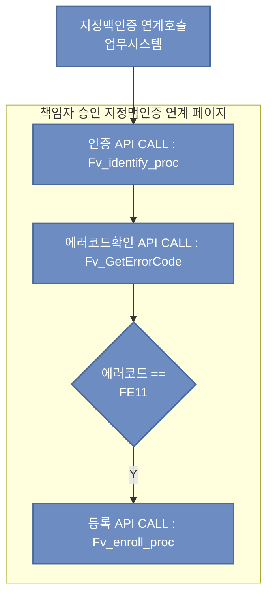
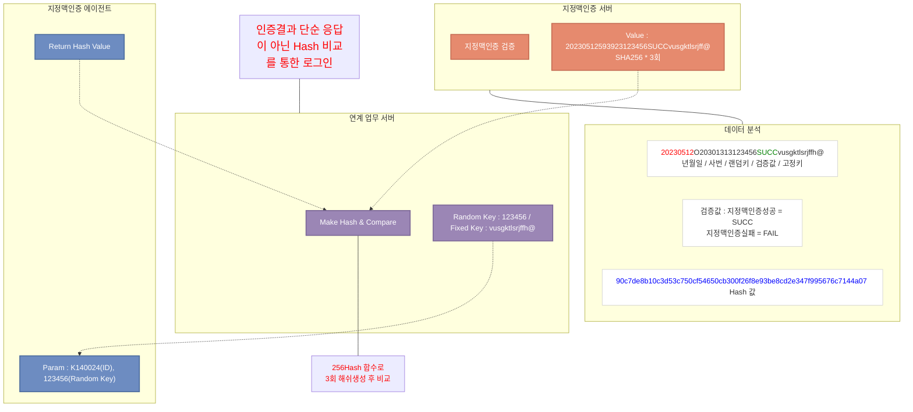
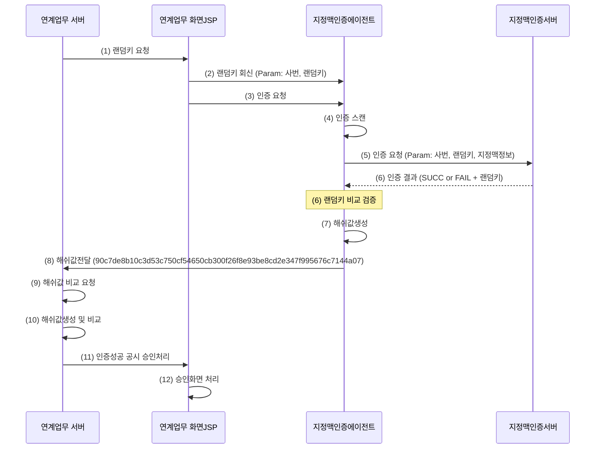

## 2차인증 연동

2차인증은 다음의 3가지 연동 방식을 사용자가 선택하여 수행할 수 있음
1. 지정맥 (기본)
2. FIDO
3. mOTP
### 🔹FIDO/mOTP

  - siteId : SIT01KDBBANK00000000
  - svcId  : SVC12SIT01KDBBANK000  

#### mOTP 인증 요청
- method : POST
- URL
1) 개발 : https://dopsap.kdb.co.kr:20443/interfBiz/processRequest.do 
2) 운영 : https://opsap.kdb.co.kr:20443/interfBiz/processRequest.do
- Request
```json
{
   "command": "requestServiceAuth",
   "svcTrId": "12345678902345678901",
   "siteId": "SIT01KDBBANK00000000",
   "svcId": "SVC12SIT01KDBBANK000",
   "loginId": "K140024",
   "crossDomain": true,
   "authType": "OTP01"
}
```
- Response
```json
{
    "resultCode": "100000",
    "resultMsg": "정상처리 되었습니다.",
    "resultData": {
        "qrImage": “iVBORw0KGgoAAAANSUhEUgAAAMgAAADIAQAAAA~”
        "trId": "15941906300500583761",
        "avlblTime": "90",
        "deviceId": "768701863103214",
        "authType": "OTP01"
    }
}
```
#### mOTP 검증
- method : POST
- URL
1) 개발 : https://dopsap.kdb.co.kr:20443/interfBiz/processRequest.do 
2) 운영 : https://opsap.kdb.co.kr:20443/interfBiz/processRequest.do
- Request
```json
{
    "command": "requestVerifyOtp",
    "trId": "15941906300500583761",
    "otpValue":"123456",
    "crossDomain": true,
    "authType":"OTP01"
}
```
- Response
```json
{
    "resultCode": "100000",
    "resultMsg": "정상처리 되었습니다."
}
```

#### FIDO 인증 요청
- method : POST
- URL
1) 개발 : https://dopsap.kdb.co.kr:20443/interfBiz/processRequest.do 
2) 운영 : https://opsap.kdb.co.kr:20443/interfBiz/processRequest.do
- Request
```json
{
 "command": "requestServiceAuth",
 "svcTrId": "12345678901234567890",
 "siteId": "SIT01KDBBANK00000000",
 "svcId": "SVC12SIT01KDBBANK000",
 "loginId": "kdb01",
 "bizAlarmType": "1",
 "crossDomain": true
}
```
- Response
```json
{
  "resultCode": "100000",
  "resultMsg": "정상처리 되었습니다.",
  "resultData": {
    "qrImage": "iVBORw0KGgoAAAANSUhEUgAAAMgAHHQsHBtN6n6vtEfA6DHGusciZ016n0Lvk5//MP1/8gszqVq4lXb82gAAAABJRU5ErkJggg==",
    "qrImageUrl": "https://dops.kdb.co.kr/grcode/getQrCodeByEP.do?enc=746f707355726c3d68747470733a2f2f6f6e657061737364656d6f2e72616f6e73656364649444f31",
    "trId": "64558834393836269971",
    "expireTime": "90",
    "authType": "FIDO1"
  }
}
```

#### FIDO 검증
- method : POST
- URL
1) 개발 : https://dopsap.kdb.co.kr:20443/interfBiz/processRequest.do 
2) 운영 : https://opsap.kdb.co.kr:20443/interfBiz/processRequest.do
- Request
svcTrId :  ONEPASS 인증 서비스 가입 / 인증 / 해지 API 요청 시 전달한 값으로 사용
```json
{      
    "command": "trResultConfirm",      
    "svcTrId": "12345678901234567890",
    "crossDomain": true
} 
```
- Response
trStatus 값이 1이면 검증 성공
```json
{
    "resultCode": "100000",
    "resultMsg": "정상처리 되었습니다.",
    "resultData": {
        "trStatus": "1",
        "trStatusMsg": "거래완료",
        "loginId": "kdb01"
    }
}
```

### 🔹지정맥

API 사양

| ID  | 기능      | API                  | ret  | param1 | param2  | param3   | param4     |
| --- | ------- | -------------------- | ---- | ------ | ------- | -------- | ---------- |
| 1   | 지정맥 인증  | Function(○, ○, ○, ○) | FE○○ | ITP    | 사번(8자리) | 랜덤키(6자리) | ‘identify’ |
| 2   | 에러코드 확인 | Function(○)          | 에러코드 | -      | -       | -        | ‘errCode’  |

에러코드

| 에러코드 | 에러구분        | 에러 메시지                                                                     |
| ---- | ----------- | -------------------------------------------------------------------------- |
| FE00 | 정상          | 인증 되었습니다                                                                   |
| FE01 | 사번 파라미터 오류  | 유효하지 않은 개인번호입니다                                                            |
| FE02 | 키 파라미터 오류   | 유효하지 않은 인증입니다                                                              |
| FE03 | 디바이스 연결 오류  | 지정맥인증 단말기 연결 오류입니다.\n기기 연결상태 확인 후 다시 시도하세요                                 |
| FE04 | 디바이스 해제 오류  | 지정맥인증 단말기 해제 오류입니다.                                                        |
| FE05 | 클라이언트 등록 오류 | 지정맥 등록 오류입니다.\n기기 연결상태 확인 후 다시 시도하세요                                       |
| FE06 | 클라이언트 인증 오류 | 지정맥이 인식되지 않았습니다.\n손가락을 다시 인식해주세요                                           |
| FE07 | 사용자 취소      | 사용자에 의해 인증이 취소되었습니다.                                                       |
| FE08 | 스캔타임아웃(30초) | 인증 시간(%u초)을 초과하였습니다                                                        |
| FE09 | 통신오류        | 지정맥 인증 서버와 연결되지 않았습니다.\n다른 인증수단을 이용해주세요                                    |
| FE10 | 사번 미등록      | 등록되지 않은 개인번호입니다                                                            |
| FE11 | 지정맥 미등록     | 지정맥 정보가 등록되어 있지 않습니다.\n등록후 다시 시도하세요                                        |
| FE12 | 지정맥 기등록     | 기등록된 지정맥입니다. .\n확인 후 다시 시도해주세요                                             |
| FE13 | 서버 등록 오류    | 등록 요청이 실패하였습니다.\n다시 시도해주세요."                                               |
| FE14 | 서버 인증 오류    | 등록된 지정맥 정보와 일치하지 않습니다.\n다시 시도해 주세요.\nXX회 인증실패                              |
| FE15 | 서버 삭제 오류    | 삭제 요청이 실패하였습니다.\n다시 시도해주세요.                                                |
| FE16 | 서버 조회 오류    | 조회 요청이 실패하였습니다.\n다시 시도해주세요                                                 |
| FE17 | 서버 변경 오류    | 변경 요청이 실패하였습니다.\n다시 시도해주세요.                                                |
| FE18 | 서버 분할 오류    | 지정맥 정보 분할처리가 실패하였습니다.\n담당자에게 문의해주세요                                        |
| FE19 | 서버 결합 오류    | 지정맥 정보 결합처리가 실패하였습니다.\n담당자에게 문의해주세요                                        |
| FE20 | 인증 실패 오류    | 인증요청이 실패하였습니다.\n확인후 다시 시도해주세요.                                             |
| FE21 | 지정맥 중복 오류   | 중복된 지정맥이 있습니다.\n손가락 확인후 다시 등록하세요                                           |
| FE22 | 계정 잠김 오류    | 지정맥 인증 잠김 상태입니다. \n지정맥인증 포털에 접속하여 "설정 → 지정맥 잠금해제"\n메뉴에서 지정맥 잠금해제 후 이용해주세요. |
| FE23 | 등록/인증 오류    | 퇴직자 또는 휴직자입니다                                                              |
| FE24 | 클라이언트 등록 오류 | 등록 요청이 실패했습니다.                                                             |

연계 처리 예시
```javascript
var wsUri = "ws://127.0.0.1:8089/bio";  		 루프백 시큐어 웹소켓 정보
var BioAgentUrl = "BioAgent://";           		// Custom URI Scheme
var CallType = "";                              		// 요청 메서드 구분

function connect( ){
    websocket = new WebSocket(wsUri);  		// 소켓 생성
    websocket.onclose = function(evt) {    		// 소켓 종료 메서드
        if(!evt.wasClean) alert(＂웹소켓이 비정상 종료되었습니다.");
    };
    
    websocket.onmessage = function(evt) { 	// 메시지 수신 메서드
        if( CallType == "getErr" ) websocket.close(); 	// “getErr” 메서드 수신 후, 소켓 종료 
        
        if( CallType == “identify” ){		// “identify”결과 수신 일 경우, 처리 결과 확인을 위해 “getErr” 메서드 호출
            getErr();
        } else {
            if( evt.data == “FE00” ) {		// “getErr” 메서드 호출 결과 여부 확인
                fnGetData();			// 후속 함수 처리 진행
            }
            websocket.close();			// 웹소켓 종료
        }
    };
    
    websocket.onerror = function(evt) { 		// 에러 처리 메서드
        websocket.close();
        if (evt.data == undefined) {
            if (window.confirm("BioAgent 파일이 실행되어있지 않습니다.\nBioAgent를 실행하시겠습니까?")){
                location.href = BioAgentUrl; 
            }
        } else {
            alert("웹소켓 통신 에러 : " + evt.data);
        }
    };
}

function fingerVeinAuth(userid){			// 지정맥 인증 호출 메서드
    CallType = ＂identify＂;				// 호출 타입 구분
    
    if ( fnOK(userid) ){     // 입력값체크			// 사번 입력 체크
        connect();				// 웹소켓 생성 및 onmessage, onerror, onclose 등록
        websocket.onopen = function(evt) { 
            var sendData = new Object();			// 전송 데이터 생성
            sendData.type = CallType;			// 호출 타입 구분
            sendData.key = ＂123456＂;			// random 데이터 (6자리)
            sendData.sysGubun = “ITS";     			// 시스템 구분 입력 (ESSO는 SSO 입력 그 외에는 전부 ITS 입력)
            sendData.id = userid;			// 사용자 사번(7~8자리)

            var jsonData = JSON.stringify(sendData);		// JSON 데이터 문자열화
            websocket.send(jsonData);			// 데이터 송신
        };
    }
}

Function getErr(){
    CallType = ＂getErr＂;					  // 호출 타입 구분
    websocket.send(JSON.stringify({"type":"errCode","key":"123456","sysGubun":“ITS"})); // 결과 코드 확인용 데이터 송신
}

```

연계 처리 예시(sample)
```html
<!DOCTYPE html>
  <meta charset="utf-8" />
  <title>지정맥 인증/등록 예제</title>
  <script language="javascript" type="text/javascript">
  var wsUri = "ws://127.0.0.1:8089/bio";
  var BioAgentUrl = "BioAgent://";
  
  function connect()
  {
    websocket = new WebSocket(wsUri);
    websocket.onclose = function(evt) 
	{ 
		//writeToScreen("DISCONNECTED");
	};
    websocket.onmessage = function(evt) 
	{ 
		if(evt.data.substr(0, 2) == "FE")
		{
			switch (evt.data)
			{
				case "FE00" :  res = "정상처리.";  break;
				case "FE01" :  res = "유효하지 않은 사번입니다.";  break;
				case "FE02" :  res = "유효하지 않은 키입니다";  break;
				case "FE03" :  res = "지정맥인증 디바이스 연결 오류입니다. 상세코드 확인후 다시 시도하세요.";  break;
				case "FE04" :  res = "지정맥인증 디바이스 해제 오류입니다.";  break;
				case "FE05" :  res = "클라이언트 등록 오류입니다. 상세코드 확인후 다시 시도하세요.";  break;
				case "FE06" :  res = "클라이언트 인증 오류입니다. 상세코드 확인후 다시 시도하세요.";  break;
				case "FE07" :  res = "사용자에 의해 스캔이 취소되었습니다.";  break;
				case "FE08" :  res = "스캔 타임아웃(30초)를 초과하였습니다.";  break;
				case "FE09" :  res = "인증서버와의 통신에 문제가 발생하였습니다. 확인후 다시 시도하세요.";  break;
				case "FE10" :  res = "등록되지 않은 사번입니다.";  break;
				case "FE11" :  res = "지정맥 정보가 등록되어 있지 않습니다. 확인후 다시 시도하세요.";  break;
				case "FE12" :  res = "등록실패:기등록된 사용자입니다. 삭제 후 등록해주세요.";  break;
				case "FE13" :  res = "서버 등록 요청이 실패하였습니다. 확인후 다시 시도하세요.";  break;
				case "FE14" :  res = "서버 인증 요청이 실패하였습니다. 확인후 다시 시도하세요.";  break;
				case "FE15" :  res = "서버 삭제 요청이 실패하였습니다. 확인후 다시 시도하세요.";  break;
				case "FE16" :  res = "서버 조회 요청이 실패하였습니다. 확인후 다시 시도하세요.";  break;
				case "FE17" :  res = "서버 변경 요청이 실패하였습니다. 확인후 다시 시도하세요.";  break;
				case "FE18" :  res = "서버 바이오정보 분할처리가 실패하였습니다. 확인후 다시 시도하세요.";  break;
				case "FE19" :  res = "서버 바이오정보 결합처리가 실패하였습니다. 확인후 다시 시도하세요.";  break;
				case "FE20" :  res = "인증요청이 실패하였습니다.\n확인후 다시 시도하세요."; break;
                case "FE21" :  res = "중복된 지정맥이 있습니다.\n손가락 확인 후 다시 등록하세요."; break;
                case "FE22" :  res = "정맥 인증 잠김 상태입니다.\n해제 후 이용해주세요"; break;
                case "FE23" :  res = "퇴직자 또는 휴직자입니다."; break;
                case "FE24" :  res = "등록 요청이 실패했습니다."; break;
 
				default: res = "알수없는 오류. 관리자에게 문의하세요"; break;
			 }
			writeToScreen('<span style="color: blue;">[ret] ' + evt.data + ' [msg] ' + res + '</span>');
		}
		writeToScreen('<span style="color: blue;">RESPONSE: ' + evt.data +'</span>');
		websocket.close();

	};
    websocket.onerror = function(evt) 
	{ 
		writeToScreen('<span style="color: red;">ERROR:</span> ' + evt.data);
		websocket.close();
		if (evt.data == undefined) 
		{
			if (window.confirm("BioAgent 파일이 실행되어있지 않습니다.\nBioAgent를 실행하시겠습니까?"))
			{
				location.href = BioAgentUrl; 
			}
		}
	};
  }

  function writeToScreen(message)
  {
    var pre = document.createElement("p");
    pre.style.wordWrap = "break-word";
    pre.innerHTML = message;
    document.getElementById("output").appendChild(pre);
  }

  function callAgent(callType){
	connect();
    websocket.onopen = function(evt) 
	{ 
		var sendData = new Object();
		sendData.type = callType;
		sendData.key = "1234567";
		sendData.sysGubun = "WEB"; 
		sendData.id = document.getElementById('id').value;
		if(callType == "enroll" || callType == "identify" || callType == "retryEnroll" || callType == "delete" || callType == "regCheck")
			sendData.fingertype = document.getElementById('fingertype').value;//FINGER_TYPE
		
		var jsonData = JSON.stringify(sendData);
		websocket.send(jsonData);
	};
  }
  function handleOnChange(e) {
  // 선택된 데이터의 값 가져오기
  const value = e.value;
  // 선택한 값 출력
  document.getElementById('output').innerText
    = value;
}

  </script>

  <h2>지정맥 등록 및 인증</h2>
  사번 : <input type="text" name="id" id="id" value=""><br><br>

<BR><BR><BR>
<select id="fingertype" name="FINGER_TYPE" onchange="handleOnChange(this)">
  <option value="9">왼손검지</option>
  <option value="17">왼손중지</option>
  <option value="33">왼손약지</option>
  <option value="10">오른손검지</option>
  <option value="18">오른손중지</option>
  <option value="34">오른손약지</option>
</select><BR><BR><BR>
<div id='result'></div>
  <button onclick="callAgent('enroll')">지정맥 등록</button>
  <button onclick="callAgent('identify')">지정맥 인증</button>
  <button onclick="callAgent('retryEnroll')">지정맥 재등록</button>
  <button onclick="callAgent('delete')">지정맥 삭제</button> 
  <button onclick="callAgent('regCheck')">등록 여부 확인</button> 
  <br><br> 
  <button onclick="callAgent('errCode')">에러 코드</button>
  <button onclick="callAgent('getVer')">버전 확인</button>
  <button onclick="callAgent('conCheck')">장치 연결</button>
  <button onclick="callAgent('verifyTest')">인증 테스트</button>  
  <button onclick="callAgent('terminate')">장치 해제</button>
  <a href ="BioAgent://"> Agent 실행하기</a> 
  <p><p>
  <div id="output"></div>
```

API 호출 예시



지정맥인증 연계 보안방안



지정맥인증 연계 호출 프로세스



해시값 생성 예시 (Make Hash)

```javascript
// SHA256 암호화 * 3회
	public String encrypt(String msg) throws Exception {
		MessageDigest digest = MessageDigest.getInstance("SHA-256");

		byte[] hash = digest.digest(msg.getBytes());

		StringBuffer hexString = new StringBuffer();

		for (int i = 0; i < hash.length; i++) {
			String hex = Integer.toHexString(0xff & hash[i]);

			if (hex.length() == 1) {
				hexString.append("0");
			}
			hexString.append(hex);
		}

		return hexString.toString();
	}

```
